## Hey there 👋, I'm [Miradil!](https://github.com/mmzeynalli/)

```yaml
experience:
    Volvo:
        Period: Dec 2025 - Current
        Location: Lund, Sweden
        Position: Consultant, Embedded Engineer
    Axis Communications AB:
        Period: Oct 2024 - Apr 2025
        Location: Lund, Sweden
        Department: New Business
        Position: Consultant, Embedded Firmware Engineer
    Axis Communcations AB:
        Period: Mar 2023 - May 2024
        Location: Lund, Sweden
        Department: R&D
        Position: Part-Time, SoC Platform Security Engineer
    Starex:
        Period: Jun 2021 - Aug 2022
        Location: Baku, Azerbaijan
        Position: Lead Python Django Developer
    Sumaks Technologies:
        Period: Nov 2017 - Jun 2021
        Location: Baku, Azerbaijan
        Position: Senior Embedded Software Engineer
technologies:
    languages: ["C", "C++", "Python"]
    embedded:
        boards: ["STM32", "ATmega", "Teensy", "LinkitOne", "Raspberry Pi", "BeagleBone Black"]
        os: ["OP-TEE OS", "Linux", "Debian", "FreeRTOS"]
        design: ["VHDL", "SystemVerilog", "Cadence"]
        testing: ["Unity Test Framework"]
    backend:
        python: ["FastAPI", "Django", "Flask"]
        testing: ["Pytest", "Unittest"]
    devOps: ["Docker", "CI/CD", "Nginx", "GitHub Actions"]
    databases: ["PostgreSQL", "MongoDB", "SQLite", "Firebase Realtime DB", "Redis", "RabbitMQ"]
    misc: ["Asyncio", "REST", "WebSockets"]
architecture:
    backend: ["microservices", "monolithic"]
    databases: ["Relational", "NoSQL", "In-memory"]
funfact: "I was a world chess champion once!"
```

## My last 5 blog posts

<!-- BLOG-POST-LIST:START -->
- [No. 1 Communication Expert: This Speaking Mistake Makes People Dislike You!](https://mmzeynalli.dev/posts/podcast-notes/the-diary-of-a-ceo/vinh-giang-communication-expert/)
- [Integrify](https://mmzeynalli.dev/posts/open-sources/integrify/)
- [Eolymp 6254: Timebomb](https://mmzeynalli.dev/posts/dsa/eolymp/6254/)
- [Hackerrank: Winning Lottery Ticket](https://mmzeynalli.dev/posts/dsa/hackerrank/winning-lottery-ticket/)
- [Leetcode 142: Linked List Cycle II](https://mmzeynalli.dev/posts/dsa/leetcode/142/)
<!-- BLOG-POST-LIST:END -->

See more [here](https://mmzeynalli.dev/posts/)

## Dev Stats

<summary><b>⚡ Coding Stats</b></summary>

</br>

<!--START_SECTION:waka-->


**🐱 My GitHub Data** 

> 📦 695.4 kB Used in GitHub's Storage 
 > 
> 🏆 313 Contributions in the Year 2026
 > 
> 💼 Opted to Hire
 > 
> 📜 31 Public Repositories 
 > 
> 🔑 13 Private Repositories 
 > 
**I'm a Night 🦉** 

```text
🌞 Morning                3616 commits        ███░░░░░░░░░░░░░░░░░░░░░░   12.10 % 
🌆 Daytime                9401 commits        ████████░░░░░░░░░░░░░░░░░   31.47 % 
🌃 Evening                12900 commits       ███████████░░░░░░░░░░░░░░   43.18 % 
🌙 Night                  3955 commits        ███░░░░░░░░░░░░░░░░░░░░░░   13.24 % 
```


📊 **This Week I Spent My Time On** 

```text
🕑︎ Time Zone: Europe/Berlin

💬 Programming Languages: 
Python                   4 hrs 29 mins       ██████████████████░░░░░░░   72.92 % 
HTML                     34 mins             ██░░░░░░░░░░░░░░░░░░░░░░░   09.32 % 
Markdown                 19 mins             █░░░░░░░░░░░░░░░░░░░░░░░░   05.19 % 
JavaScript               15 mins             █░░░░░░░░░░░░░░░░░░░░░░░░   04.31 % 
JSON with Comments       14 mins             █░░░░░░░░░░░░░░░░░░░░░░░░   03.83 % 

🐱‍💻 Projects: 
sqladmin-test            2 hrs 56 mins       ████████████░░░░░░░░░░░░░   47.88 % 
sqladmin                 2 hrs 20 mins       █████████░░░░░░░░░░░░░░░░   37.94 % 
fromfolio-backend-v2     34 mins             ██░░░░░░░░░░░░░░░░░░░░░░░   09.38 % 
hp_integration_test_libra16 mins             █░░░░░░░░░░░░░░░░░░░░░░░░   04.49 % 
js                       1 min               ░░░░░░░░░░░░░░░░░░░░░░░░░   00.32 % 
```

**I Mostly Code in Python** 

```text
Python                   32 repos            ████████████░░░░░░░░░░░░░   50.00 % 
TypeScript               6 repos             ██░░░░░░░░░░░░░░░░░░░░░░░   09.38 % 
C++                      5 repos             ██░░░░░░░░░░░░░░░░░░░░░░░   07.81 % 
HTML                     3 repos             █░░░░░░░░░░░░░░░░░░░░░░░░   04.69 % 
PDDL                     1 repo              ░░░░░░░░░░░░░░░░░░░░░░░░░   01.56 % 
```


 Last Updated on 24/04/2026 01:31:23 UTC
<!--END_SECTION:waka-->

<summary><b> Github Stats</b></summary>




## Miradil's Chess Game

Play a chess game with me!

### **Game is in progress.** This is open to ANYONE to play the next move. That's the point. :wave: 

<!-- BEGIN CHESS BOARD -->
|   | H | G | F | E | D | C | B | A |   |
|---|:-:|:-:|:-:|:-:|:-:|:-:|:-:|:-:|:-:|
| **1** |  |  |  |  |  |  |  |  | **1** |
| **2** |  |  |  |  |  |  |  |  | **2** |
| **3** |  |  |  |  |  |  |  |  | **3** |
| **4** |  |  |  |  |  |  |  |  | **4** |
| **5** |  |  |  |  |  |  |  |  | **5** |
| **6** |  |  |  |  |  |  |  |  | **6** |
| **7** |  |  |  |  |  |  |  |  | **7** |
| **8** |  |  |  |  |  |  |  |  | **8** |
|   | **H** | **G** | **F** | **E** | **D** | **C** | **B** | **A** |   |
<!-- END CHESS BOARD -->

### It's your turn to play! Move a <!-- BEGIN TURN -->black<!-- END TURN --> piece!
<!-- BEGIN MOVES LIST -->
|  FROM  | TO (Just click a link!) |
| :----: | :---------------------- |
| **A6** | [A5](https://github.com/mmzeynalli/mmzeynalli/issues/new?body=Please+do+not+change+the+title.+Just+click+%22Submit+new+issue%22.+You+don%27t+need+to+do+anything+else+%3AD&title=Chess%3A+Move+A6+to+A5) |
| **A8** | [A7](https://github.com/mmzeynalli/mmzeynalli/issues/new?body=Please+do+not+change+the+title.+Just+click+%22Submit+new+issue%22.+You+don%27t+need+to+do+anything+else+%3AD&title=Chess%3A+Move+A8+to+A7) |
| **B4** | [A3](https://github.com/mmzeynalli/mmzeynalli/issues/new?body=Please+do+not+change+the+title.+Just+click+%22Submit+new+issue%22.+You+don%27t+need+to+do+anything+else+%3AD&title=Chess%3A+Move+B4+to+A3), [A5](https://github.com/mmzeynalli/mmzeynalli/issues/new?body=Please+do+not+change+the+title.+Just+click+%22Submit+new+issue%22.+You+don%27t+need+to+do+anything+else+%3AD&title=Chess%3A+Move+B4+to+A5), [C3](https://github.com/mmzeynalli/mmzeynalli/issues/new?body=Please+do+not+change+the+title.+Just+click+%22Submit+new+issue%22.+You+don%27t+need+to+do+anything+else+%3AD&title=Chess%3A+Move+B4+to+C3), [C5](https://github.com/mmzeynalli/mmzeynalli/issues/new?body=Please+do+not+change+the+title.+Just+click+%22Submit+new+issue%22.+You+don%27t+need+to+do+anything+else+%3AD&title=Chess%3A+Move+B4+to+C5), [D2](https://github.com/mmzeynalli/mmzeynalli/issues/new?body=Please+do+not+change+the+title.+Just+click+%22Submit+new+issue%22.+You+don%27t+need+to+do+anything+else+%3AD&title=Chess%3A+Move+B4+to+D2), [D6](https://github.com/mmzeynalli/mmzeynalli/issues/new?body=Please+do+not+change+the+title.+Just+click+%22Submit+new+issue%22.+You+don%27t+need+to+do+anything+else+%3AD&title=Chess%3A+Move+B4+to+D6), [E1](https://github.com/mmzeynalli/mmzeynalli/issues/new?body=Please+do+not+change+the+title.+Just+click+%22Submit+new+issue%22.+You+don%27t+need+to+do+anything+else+%3AD&title=Chess%3A+Move+B4+to+E1), [E7](https://github.com/mmzeynalli/mmzeynalli/issues/new?body=Please+do+not+change+the+title.+Just+click+%22Submit+new+issue%22.+You+don%27t+need+to+do+anything+else+%3AD&title=Chess%3A+Move+B4+to+E7), [F8](https://github.com/mmzeynalli/mmzeynalli/issues/new?body=Please+do+not+change+the+title.+Just+click+%22Submit+new+issue%22.+You+don%27t+need+to+do+anything+else+%3AD&title=Chess%3A+Move+B4+to+F8) |
| **B7** | [B5](https://github.com/mmzeynalli/mmzeynalli/issues/new?body=Please+do+not+change+the+title.+Just+click+%22Submit+new+issue%22.+You+don%27t+need+to+do+anything+else+%3AD&title=Chess%3A+Move+B7+to+B5), [B6](https://github.com/mmzeynalli/mmzeynalli/issues/new?body=Please+do+not+change+the+title.+Just+click+%22Submit+new+issue%22.+You+don%27t+need+to+do+anything+else+%3AD&title=Chess%3A+Move+B7+to+B6) |
| **B8** | [C6](https://github.com/mmzeynalli/mmzeynalli/issues/new?body=Please+do+not+change+the+title.+Just+click+%22Submit+new+issue%22.+You+don%27t+need+to+do+anything+else+%3AD&title=Chess%3A+Move+B8+to+C6), [D7](https://github.com/mmzeynalli/mmzeynalli/issues/new?body=Please+do+not+change+the+title.+Just+click+%22Submit+new+issue%22.+You+don%27t+need+to+do+anything+else+%3AD&title=Chess%3A+Move+B8+to+D7) |
| **C4** | [C3](https://github.com/mmzeynalli/mmzeynalli/issues/new?body=Please+do+not+change+the+title.+Just+click+%22Submit+new+issue%22.+You+don%27t+need+to+do+anything+else+%3AD&title=Chess%3A+Move+C4+to+C3) |
| **C7** | [C5](https://github.com/mmzeynalli/mmzeynalli/issues/new?body=Please+do+not+change+the+title.+Just+click+%22Submit+new+issue%22.+You+don%27t+need+to+do+anything+else+%3AD&title=Chess%3A+Move+C7+to+C5), [C6](https://github.com/mmzeynalli/mmzeynalli/issues/new?body=Please+do+not+change+the+title.+Just+click+%22Submit+new+issue%22.+You+don%27t+need+to+do+anything+else+%3AD&title=Chess%3A+Move+C7+to+C6) |
| **C8** | [D7](https://github.com/mmzeynalli/mmzeynalli/issues/new?body=Please+do+not+change+the+title.+Just+click+%22Submit+new+issue%22.+You+don%27t+need+to+do+anything+else+%3AD&title=Chess%3A+Move+C8+to+D7) |
| **D8** | [D4](https://github.com/mmzeynalli/mmzeynalli/issues/new?body=Please+do+not+change+the+title.+Just+click+%22Submit+new+issue%22.+You+don%27t+need+to+do+anything+else+%3AD&title=Chess%3A+Move+D8+to+D4), [D5](https://github.com/mmzeynalli/mmzeynalli/issues/new?body=Please+do+not+change+the+title.+Just+click+%22Submit+new+issue%22.+You+don%27t+need+to+do+anything+else+%3AD&title=Chess%3A+Move+D8+to+D5), [D6](https://github.com/mmzeynalli/mmzeynalli/issues/new?body=Please+do+not+change+the+title.+Just+click+%22Submit+new+issue%22.+You+don%27t+need+to+do+anything+else+%3AD&title=Chess%3A+Move+D8+to+D6), [D7](https://github.com/mmzeynalli/mmzeynalli/issues/new?body=Please+do+not+change+the+title.+Just+click+%22Submit+new+issue%22.+You+don%27t+need+to+do+anything+else+%3AD&title=Chess%3A+Move+D8+to+D7), [E7](https://github.com/mmzeynalli/mmzeynalli/issues/new?body=Please+do+not+change+the+title.+Just+click+%22Submit+new+issue%22.+You+don%27t+need+to+do+anything+else+%3AD&title=Chess%3A+Move+D8+to+E7), [F6](https://github.com/mmzeynalli/mmzeynalli/issues/new?body=Please+do+not+change+the+title.+Just+click+%22Submit+new+issue%22.+You+don%27t+need+to+do+anything+else+%3AD&title=Chess%3A+Move+D8+to+F6) |
| **E6** | [E5](https://github.com/mmzeynalli/mmzeynalli/issues/new?body=Please+do+not+change+the+title.+Just+click+%22Submit+new+issue%22.+You+don%27t+need+to+do+anything+else+%3AD&title=Chess%3A+Move+E6+to+E5) |
| **E8** | [D7](https://github.com/mmzeynalli/mmzeynalli/issues/new?body=Please+do+not+change+the+title.+Just+click+%22Submit+new+issue%22.+You+don%27t+need+to+do+anything+else+%3AD&title=Chess%3A+Move+E8+to+D7), [F8](https://github.com/mmzeynalli/mmzeynalli/issues/new?body=Please+do+not+change+the+title.+Just+click+%22Submit+new+issue%22.+You+don%27t+need+to+do+anything+else+%3AD&title=Chess%3A+Move+E8+to+F8), [G8](https://github.com/mmzeynalli/mmzeynalli/issues/new?body=Please+do+not+change+the+title.+Just+click+%22Submit+new+issue%22.+You+don%27t+need+to+do+anything+else+%3AD&title=Chess%3A+Move+E8+to+G8) |
| **G5** | [G4](https://github.com/mmzeynalli/mmzeynalli/issues/new?body=Please+do+not+change+the+title.+Just+click+%22Submit+new+issue%22.+You+don%27t+need+to+do+anything+else+%3AD&title=Chess%3A+Move+G5+to+G4) |
| **G7** | [F6](https://github.com/mmzeynalli/mmzeynalli/issues/new?body=Please+do+not+change+the+title.+Just+click+%22Submit+new+issue%22.+You+don%27t+need+to+do+anything+else+%3AD&title=Chess%3A+Move+G7+to+F6), [G6](https://github.com/mmzeynalli/mmzeynalli/issues/new?body=Please+do+not+change+the+title.+Just+click+%22Submit+new+issue%22.+You+don%27t+need+to+do+anything+else+%3AD&title=Chess%3A+Move+G7+to+G6) |
| **H8** | [F8](https://github.com/mmzeynalli/mmzeynalli/issues/new?body=Please+do+not+change+the+title.+Just+click+%22Submit+new+issue%22.+You+don%27t+need+to+do+anything+else+%3AD&title=Chess%3A+Move+H8+to+F8), [G8](https://github.com/mmzeynalli/mmzeynalli/issues/new?body=Please+do+not+change+the+title.+Just+click+%22Submit+new+issue%22.+You+don%27t+need+to+do+anything+else+%3AD&title=Chess%3A+Move+H8+to+G8), [H2](https://github.com/mmzeynalli/mmzeynalli/issues/new?body=Please+do+not+change+the+title.+Just+click+%22Submit+new+issue%22.+You+don%27t+need+to+do+anything+else+%3AD&title=Chess%3A+Move+H8+to+H2), [H3](https://github.com/mmzeynalli/mmzeynalli/issues/new?body=Please+do+not+change+the+title.+Just+click+%22Submit+new+issue%22.+You+don%27t+need+to+do+anything+else+%3AD&title=Chess%3A+Move+H8+to+H3), [H4](https://github.com/mmzeynalli/mmzeynalli/issues/new?body=Please+do+not+change+the+title.+Just+click+%22Submit+new+issue%22.+You+don%27t+need+to+do+anything+else+%3AD&title=Chess%3A+Move+H8+to+H4), [H5](https://github.com/mmzeynalli/mmzeynalli/issues/new?body=Please+do+not+change+the+title.+Just+click+%22Submit+new+issue%22.+You+don%27t+need+to+do+anything+else+%3AD&title=Chess%3A+Move+H8+to+H5), [H6](https://github.com/mmzeynalli/mmzeynalli/issues/new?body=Please+do+not+change+the+title.+Just+click+%22Submit+new+issue%22.+You+don%27t+need+to+do+anything+else+%3AD&title=Chess%3A+Move+H8+to+H6), [H7](https://github.com/mmzeynalli/mmzeynalli/issues/new?body=Please+do+not+change+the+title.+Just+click+%22Submit+new+issue%22.+You+don%27t+need+to+do+anything+else+%3AD&title=Chess%3A+Move+H8+to+H7) |
<!-- END MOVES LIST -->

### How this works

When you click a link, it opens a GitHub Issue with the required pre-populated text. Just push "Create New Issue". That will trigger a [GitHub Actions](https://github.blog/2020-07-03-github-action-hero-casey-lee/#getting-started-with-github-actions) workflow that'll update my GitHub Profile  with the new state of the board.

<details>
  <summary>Last 5 moves in this game</summary>
<!-- BEGIN LAST MOVES -->

| Move | Author |
| :--: | :----- |
| `E5` to `F6` | [ @BorgRancher](https://github.com/BorgRancher) |
| `H6` to `G5` | [ @smac89](https://github.com/smac89) |
| `E4` to `E5` | [ @aryan3939](https://github.com/aryan3939) |
| `H7` to `H6` | [ @mmzeynalli](https://github.com/mmzeynalli) |
| `F3` to `G5` | [ @printlyproject](https://github.com/printlyproject) |

<!-- END LAST MOVES -->
</details>

<!-- START_RATING_GRAPH:lichess -->
Lichess rating chart for the last 80 games:

```ascii
2634 ┤ ╭╮
2628 ┼╮│╰─╮
2623 ┤╰╯  ╰╮ ╭╮╭╮
2617 ┤     ╰╮│╰╯│
2611 ┤      ╰╯  ╰╮
2606 ┤           ╰─╮
2600 ┤             ╰─╮ ╭╮╭╮
2594 ┤               ╰─╯╰╯╰╮   ╭─╮
2589 ┤                     ╰─╮ │ ╰╮
2583 ┤                       ╰─╯  ╰╮
2577 ┤                             ╰╮╭╮╭─╮
2572 ┤                              ╰╯╰╯ ╰╮╭╮
2566 ┤                                    ╰╯╰─╮
2560 ┤                                        ╰╮
2555 ┤                                         ╰─╮
2549 ┤                                           ╰╮  ╭╮ ╭╮             ╭╮             ╭╮
2543 ┤                                            ╰──╯│ │╰╮   ╭╮╭╮     │╰╮╭╮╭─╮ ╭╮    │╰╮
2538 ┤                                                ╰─╯ ╰╮ ╭╯╰╯╰╮   ╭╯ ╰╯╰╯ │╭╯╰╮╭╮╭╯ ╰╮╭╮
2532 ┤                                                     ╰─╯    ╰─╮╭╯       ╰╯  ╰╯╰╯   ╰╯╰╮
2526 ┤                                                              ╰╯                      ╰─╮╭╮╭─╮╭╮ ╭─
2521 ┤                                                                                        ╰╯╰╯ ╰╯╰─╯
2515 ┤
```
<!-- END_RATING_GRAPH:lichess -->

### Notice a problem?

Raise an [issue](https://github.com/mmzeynalli/mmzeynalli/issues), and include the text _cc @mmzeynalli_.
